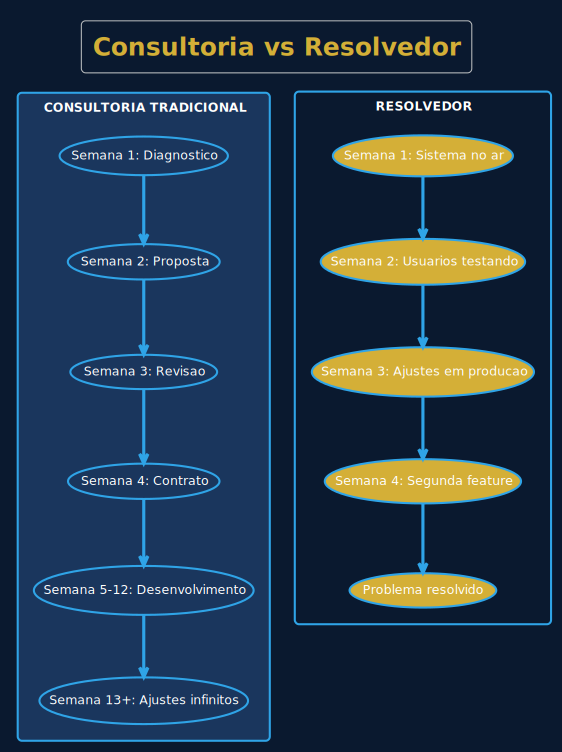
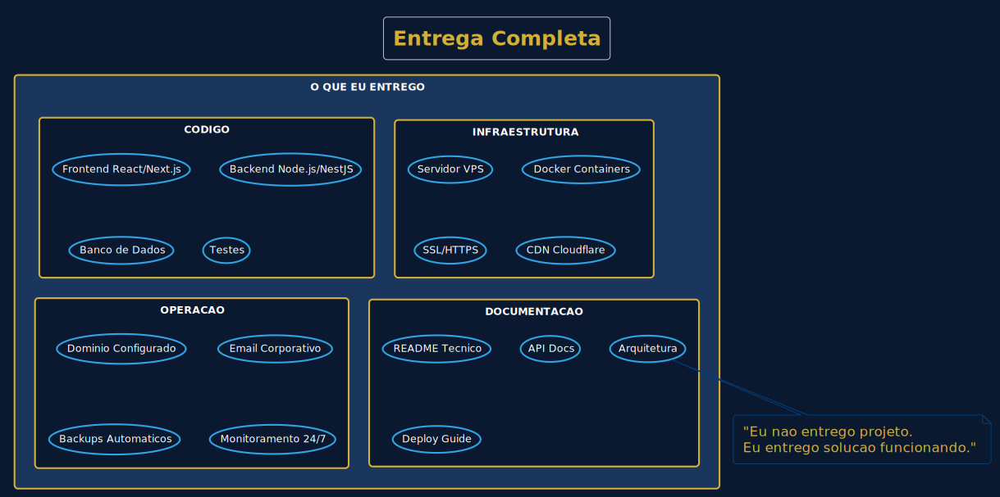
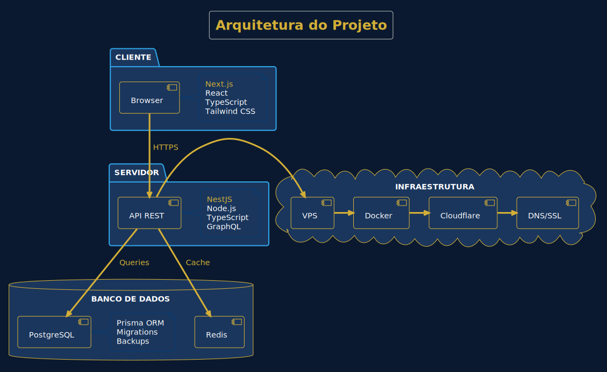
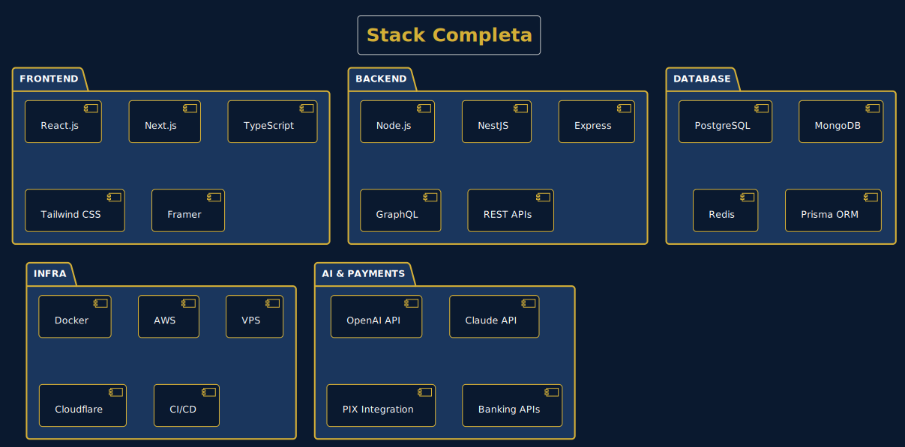
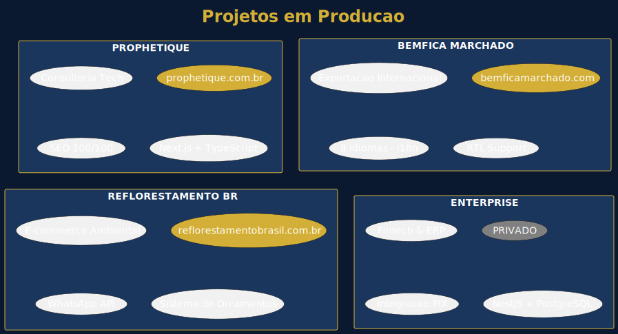
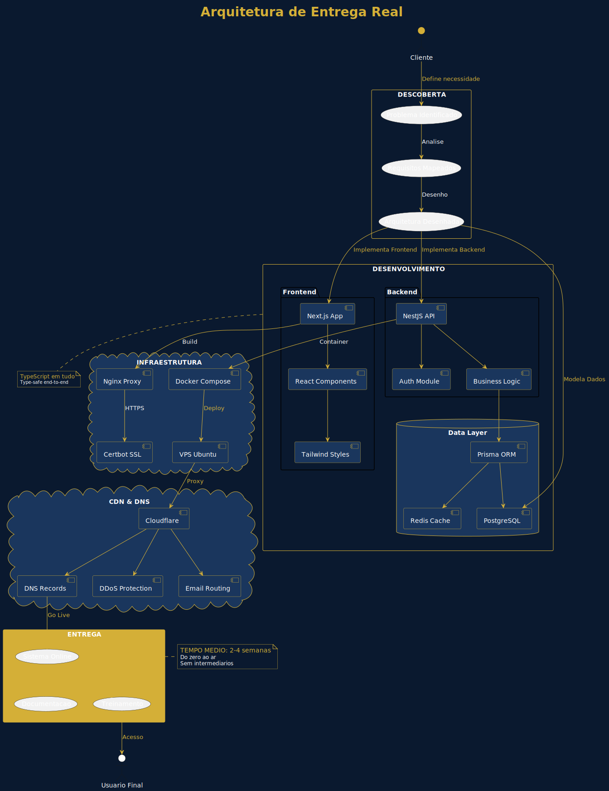

<div align="center">

<br>

# O Problema Que Ninguem Quer Admitir

<br>


<br>

### A industria de software esta quebrada. E todo mundo finge que nao.

<br>

</div>

---

<br>

## A Verdade Incomoda

Voce ja reparou que:

- **Consultorias** cobram fortunas pra entregar PowerPoints
- **Agencias** vendem "transformacao digital" que nunca sai do papel
- **Devs seniors** ficam 3 meses em "onboarding" antes de commitar uma linha
- **Squads ageis** tem reuniao de planning pra decidir quando vai ser a proxima reuniao

E no final, **ninguem entrega nada**.

O cliente paga. O projeto atrasa. O sistema nunca vai pro ar. E todo mundo acha normal.

**Eu nao acho.**

<br>

---

<br>

## Minha Abordagem e Simples (Por Isso Funciona)

```
Semana 1: Sistema no ar
Semana 2: Usuarios testando
Semana 3: Ajustes em producao
Semana 4: Proxima feature

Nao tem misterio. Tem trabalho.
```

Enquanto sua consultoria ainda esta "mapeando requisitos", eu ja coloquei o MVP pra rodar.

<br>

<div align="center">
  
</div>

<br>

---

<br>

## Por Que Isso e Polemico?

Porque desafia o modelo de negocio de muita gente.

**Consultorias precisam que projetos demorem.** Elas cobram por hora/mes.

**Agencias precisam de escopo infinito.** Mais escopo = mais faturamento.

**Muitos devs precisam de estrutura.** Tech lead, PM, PO, Scrum Master... pra entregar um CRUD.

Eu nao preciso de nada disso pra entregar.

E isso incomoda.

<br>

---

<br>

## O Que Eu Realmente Entrego

Nao vendo "consultoria". Nao vendo "horas de desenvolvimento". Nao vendo "transformacao digital".

**Vendo sistema funcionando.**

<br>

<div align="center">
  
</div>

<br>

```
O QUE TA INCLUSO:

[x] Codigo em producao (nao no seu localhost)
[x] Servidor configurado (nao "voce se vira")
[x] Dominio + SSL + Email (nao "isso e com TI")
[x] Documentacao (nao "ta na minha cabeca")
[x] Treinamento (nao "e intuitivo")

Voce recebe chave na mao. Nao recebe problema.
```

<br>

---

<br>

## A Arquitetura (Antes do Codigo)

90% dos projetos que dao errado comecaram sem desenho.

Dev pulou direto pro codigo. Cliente pediu "so mais uma coisinha". Sistema virou Frankenstein. Ninguem entende mais nada.

**Eu desenho antes.**

<br>

<div align="center">
  
</div>

<br>

Cada decisao tecnica tem justificativa. Cada camada tem responsabilidade clara. Quando o cliente pede mudanca, eu sei exatamente onde mexer.

<br>

---

<br>

## Stack (Sem Mimimi)

Nao uso tecnologia pra impressionar. Uso o que resolve.

<br>

<div align="center">
  
</div>

<br>

<table>
<tr>
<td align="center" width="25%">
<br>
<strong>Frontend</strong><br>
<sub>O que o usuario ve</sub>
</td>
<td align="center" width="25%">
<br>
<strong>Backend</strong><br>
<sub>O que faz funcionar</sub>
</td>
<td align="center" width="25%">
<br>
<strong>Database</strong><br>
<sub>Onde guarda</sub>
</td>
<td align="center" width="25%">
<br>
<strong>Infra</strong><br>
<sub>Onde roda</sub>
</td>
</tr>
</table>

<br>

**TypeScript em tudo.** Porque debugar erro de tipo em producao as 2h da manha nao e minha ideia de diversao.

<br>

---

<br>

## Projetos Reais (Nao Projetos de Curso)

Facil falar. Dificil mostrar.

<br>

<div align="center">
  
</div>

<br>

| Projeto | O Que E | O Que Tem | Prova |
|---------|---------|-----------|-------|
| **prophetique.com.br** | Consultoria Tech | SEO 100, Performance A+ | <a href="https://prophetique.com.br"></a> |
| **bemficamarchado.com** | Export Internacional | 8 idiomas, RTL, Multi-moeda | <a href="https://bemficamarchado.com"></a> |
| **reflorestamentobrasil.com.br** | E-commerce Ambiental | WhatsApp API, Orcamentos | <a href="https://reflorestamentobrasil.com.br"></a> |
| **Enterprise** | Fintech & ERP | PIX, Banking APIs |  |

<br>

Clica. Ve. Testa no celular. Abre o DevTools. Roda o Lighthouse.

**Se nao ta no ar, nao existe.**

<br>

---

<br>

## O Fluxo Completo

Do "tenho uma ideia" ate "ta funcionando":

<br>

<div align="center">
  
</div>

<br>

---

<br>

## Quanto Tempo?

| Tipo | Prazo Real | Inclui |
|:-----|:----------:|:-------|
| **Landing Page** | 1 semana | Design, codigo, deploy, dominio |
| **Sistema Web** | 2-4 semanas | Full-stack, auth, API, infra |
| **E-commerce** | 3-5 semanas | Catalogo, pagamento, admin |
| **MVP SaaS** | 4-6 semanas | Multi-tenant, billing, dashboard |

Sim, e rapido. Nao, nao e gambiarra.

**E foco.**

<br>

---

<br>

## A Pergunta Que Ninguem Faz

> "Por que contratar uma pessoa se posso contratar uma equipe?"

Porque equipe nao garante entrega. **Responsabilidade garante.**

Quando e uma pessoa, nao tem "o backend ta esperando o frontend" ou "a gente ta bloqueado pelo DevOps". Tem uma pessoa que resolve tudo, de ponta a ponta.

E se der merda, voce sabe exatamente quem cobrar.

**Accountability.**

<br>

---

<br>

## Isso Nao e Pra Todo Mundo

Se voce quer:
- Reunioes semanais de status
- Sprints com 47 story points
- Um PM pra traduzir o que o dev falou
- Alguem pra culpar quando der errado

**Eu nao sou a pessoa certa.**

Agora, se voce quer:
- Sistema funcionando rapido
- Uma pessoa que entende e resolve
- Comunicacao direta sem intermediario
- Resultado, nao processo

**Ai a gente conversa.**

<br>

---

<br>

<div align="center">

## Contato

<br>

**Herison Araujo**

Dev que entrega

<br>

<a href="https://herisonaraujo.github.io">
  
</a>

<br><br>

<a href="https://linkedin.com/in/herison-araujo">
  
</a>
&nbsp;
<a href="https://github.com/herisonaraujo">
  
</a>

<br><br>

<a href="mailto:herison@prophetique.com.br">
  
</a>
&nbsp;&nbsp;
<a href="https://wa.me/5532999735469">
  
</a>

<br><br>

---

<br>


<br>

*"Menos reuniao, mais deploy."*

<br>

</div>
