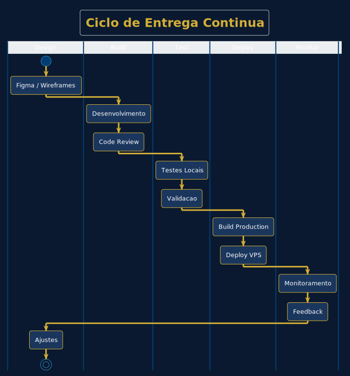

<div align="center">

# Metodologia de Desenvolvimento

### Arquitetura, Processo e Entrega de Software

<br>

[](https://github.com/herisonaraujo)
[](https://www.typescriptlang.org/)
[](https://github.com/herisonaraujo)

<br>

**Documentacao completa da metodologia de desenvolvimento utilizada em projetos de software.**

[Arquitetura](#arquitetura) • [Processo](#processo-de-entrega) • [Stack](#stack-tecnologica) • [Projetos](#projetos-em-producao) • [Contato](#contato)

<br>

---

</div>

## Visao Geral

Este repositorio documenta a metodologia de desenvolvimento aplicada em projetos de software corporativo. O objetivo e garantir entregas consistentes, documentadas e em producao.

```
Problema identificado → Arquitetura desenhada → Codigo em producao
```

<br>

## Arquitetura

O desenho da arquitetura precede qualquer linha de codigo. Isso garante clareza nas decisoes tecnicas e alinhamento com os requisitos de negocio.

<br>

<div align="center">

### Arquitetura Base


</div>

<br>

### Camadas do Sistema

| Camada | Responsabilidade | Tecnologias |
|--------|------------------|-------------|
| **Cliente** | Interface do usuario, experiencia, responsividade | Next.js, React, Tailwind CSS |
| **Servidor** | Logica de negocio, autenticacao, APIs | NestJS, Node.js, TypeScript |
| **Dados** | Persistencia, cache, queries otimizadas | PostgreSQL, Redis, Prisma ORM |
| **Infraestrutura** | Hospedagem, seguranca, performance | Docker, VPS, Cloudflare, SSL |

<br>

---

<br>

## Processo de Entrega

O ciclo de entrega e continuo e orientado a producao. Cada iteracao resulta em software funcionando.

<br>

<div align="center">

### Ciclo de Entrega



</div>

<br>

### Fases do Ciclo

```
┌─────────────────────────────────────────────────────────────────────────┐
│                                                                         │
│   DESIGN        BUILD         TEST          DEPLOY        MONITOR      │
│   ──────        ─────         ────          ──────        ───────      │
│   Wireframes    Codigo        Unitarios     Build         Logs         │
│   Prototipos    Review        Integracao    Container     Metricas     │
│   UI/UX         Refactor      E2E           Producao      Alertas      │
│                                                                         │
└─────────────────────────────────────────────────────────────────────────┘
```

<br>

---

<br>

## Stack Tecnologica

Stack moderna, type-safe e otimizada para produtividade e manutencao.

<br>

<div align="center">

### Stack Completa


</div>

<br>

### Detalhamento

<table>
<tr>
<td width="25%" valign="top">

**Frontend**
- React.js
- Next.js 14+
- TypeScript
- Tailwind CSS
- Framer Motion

</td>
<td width="25%" valign="top">

**Backend**
- Node.js
- NestJS
- Express
- GraphQL
- REST APIs

</td>
<td width="25%" valign="top">

**Database**
- PostgreSQL
- MongoDB
- Redis
- Prisma ORM
- Drizzle

</td>
<td width="25%" valign="top">

**Infra**
- Docker
- AWS / VPS
- Cloudflare
- CI/CD
- Nginx

</td>
</tr>
</table>

<br>

### Integracoes Especializadas

| Categoria | Tecnologias |
|-----------|-------------|
| **AI & LLMs** | OpenAI API, Claude API, AI Agents, Embeddings |
| **Pagamentos** | PIX, Banking APIs, Payment Gateways |
| **Comunicacao** | WhatsApp API, Email Transacional, SMS |
| **Analytics** | Google Analytics, Eventos customizados |

<br>

---

<br>

## Entrega Completa

Nao entrego apenas codigo. Entrego solucao funcionando em producao.

<br>

<div align="center">

### O Que Esta Incluido


</div>

<br>

### Checklist de Entrega

```
CODIGO                    INFRAESTRUTURA           OPERACAO
──────                    ──────────────           ────────
[x] Frontend              [x] Servidor VPS         [x] Dominio configurado
[x] Backend               [x] Docker containers    [x] Email corporativo
[x] Banco de dados        [x] SSL/HTTPS            [x] Backups automaticos
[x] Testes                [x] CDN Cloudflare       [x] Monitoramento 24/7

DOCUMENTACAO
────────────
[x] README tecnico
[x] API documentation
[x] Deploy guide
[x] Diagrama de arquitetura
```

<br>

---

<br>

## Fluxo de Entrega Real

Do briefing ate o sistema online, com todas as conexoes explicitas.

<br>

<div align="center">

### Fluxo Completo


</div>

<br>

### Tempo Medio de Entrega

| Tipo de Projeto | Prazo | Inclui |
|-----------------|-------|--------|
| Landing Page | 1 semana | Design, codigo, deploy, dominio |
| Sistema Web | 2-4 semanas | Full-stack, auth, API, infra |
| E-commerce | 3-5 semanas | Catalogo, carrinho, pagamento, admin |
| SaaS MVP | 4-6 semanas | Multi-tenant, billing, dashboard |

<br>

---

<br>

## Projetos em Producao

Cases reais com sistemas ativos e usuarios.

<br>

<div align="center">


</div>

<br>

### Portfolio Ativo

| Projeto | Tipo | Destaques | Status |
|---------|------|-----------|--------|
| [prophetique.com.br](https://prophetique.com.br) | Consultoria Tech | SEO 100/100, Performance otimizada | []() |
| [bemficamarchado.com](https://bemficamarchado.com) | Exportacao Internacional | 8 idiomas, RTL, Multi-moeda | []() |
| [reflorestamentobrasil.com.br](https://reflorestamentobrasil.com.br) | E-commerce Ambiental | WhatsApp API, Sistema de orcamentos | []() |
| Enterprise Systems | Fintech & ERP | PIX, Banking, Microservices | []() |

<br>

---

<br>

## Abordagem

<div align="center">

### Consultoria Tradicional vs Entrega Direta


</div>

<br>

```
CONSULTORIA TRADICIONAL              ENTREGA DIRETA
───────────────────────              ──────────────

Semana 1: Diagnostico                Semana 1: Sistema no ar
Semana 2: Proposta                   Semana 2: Usuarios testando
Semana 3: Revisao                    Semana 3: Ajustes em producao
Semana 4: Contrato                   Semana 4: Segunda feature pronta
Semana 5-12: Desenvolvimento
Semana 13+: Ajustes infinitos        Problema resolvido.
```

<br>

---

<br>

## Estrutura do Repositorio

```
metodologia-dev/
│
├── README.md                 # Este documento
├── LICENSE
│
├── architecture/             # Diagramas de arquitetura
│   ├── 01-arquitetura.svg
│   ├── 02-ciclo-entrega.svg
│   ├── 03-comparacao.svg
│   ├── 04-stack.svg
│   ├── 05-projetos.svg
│   ├── 06-entrega.svg
│   ├── 07-fluxo-entrega-real.svg
│   └── *.puml                # Fontes PlantUML
│
├── docs/                     # Documentacao detalhada
│   ├── ARCHITECTURE.md
│   ├── STACK.md
│   └── DEPLOYMENT.md
│
└── templates/                # Templates reutilizaveis
    ├── project-structure.md
    └── api-documentation.md
```

<br>

---

<br>

## Contato

<div align="center">

<br>

**Herison da Costa Araujo**

Full-Stack Developer

<br>

[](https://herisonaraujo.github.io)

[](https://linkedin.com/in/herison-araujo)

[](https://github.com/herisonaraujo)

<br>

[](mailto:herison@prophetique.com.br)
[%2099973--5469-25D366?style=flat-square)](https://wa.me/5532999735469)

<br>

---

<br>

*"Arquitetura primeiro, codigo depois. Excelencia em cada entrega."*

<br>

</div>
