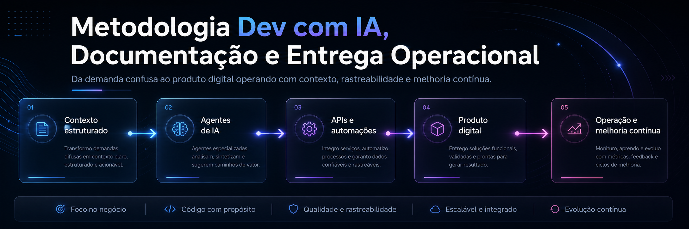
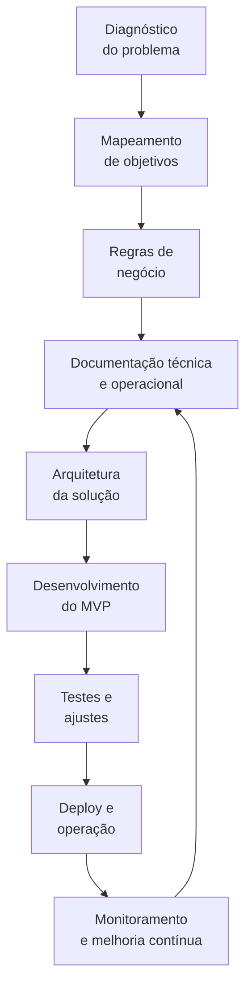
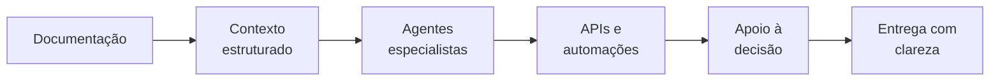

  

  
  
  

---

## O que este repositório representa

Este repositório documenta minha forma de transformar demandas digitais em produtos operáveis, combinando **IA aplicada**, **documentação técnica**, **organização de contexto**, **automação**, **cloud**, **APIs** e **execução prática**.

A proposta é criar um método de entrega mais claro, rastreável e eficiente, onde cada decisão técnica, regra de negócio e fluxo operacional tenha contexto, documentação e caminho de evolução.

---

## O problema que eu resolvo

Muitas soluções digitais não falham por falta de código. Elas falham por falta de clareza.

| Desafio comum                     | Como trato na metodologia                                  |
| --------------------------------- | ---------------------------------------------------------- |
| Ideia solta, sem escopo claro     | Transformo em objetivos, requisitos e prioridades          |
| Regras de negócio espalhadas      | Organizo em documentação e fluxos de decisão               |
| Dependência excessiva de reuniões | Crio contexto escrito, checklists e rastreabilidade        |
| IA sendo usada sem critério       | Defino papéis, limites, contexto e regras para agentes     |
| Produto sem operação              | Projeto painel, rotina, permissões, dados e acompanhamento |
| Entrega sem evolução              | Estruturo ciclos de melhoria contínua e documentação viva  |

---

## Visão geral da metodologia

```mermaid
flowchart TD
    A["Diagnóstico<br/>do problema"] --> B["Mapeamento<br/>de objetivos"]
    B --> C["Regras de<br/>negócio"]
    C --> D["Documentação técnica<br/>e operacional"]
    D --> E["Arquitetura<br/>da solução"]
    E --> F["Desenvolvimento<br/>do MVP"]
    F --> G["Testes e<br/>ajustes"]
    G --> H["Deploy e<br/>operação"]
    H --> I["Monitoramento<br/>e melhoria contínua"]
    I --> D
```

---

## Como a IA entra no processo

A IA entra como uma camada de apoio à organização, execução e análise, ajudando a transformar contexto em entregas mais claras, rastreáveis e funcionais.

```mermaid
flowchart LR
    A["Documentação"] --> B["Contexto<br/>estruturado"]
    B --> C["Agentes<br/>especialistas"]
    C --> D["APIs e<br/>automações"]
    D --> E["Apoio à<br/>decisão"]
    E --> F["Entrega com<br/>clareza"]
```

### Aplicações práticas

* Criação de agentes especialistas por domínio.
* Organização de bases de conhecimento para contexto e consulta.
* Leitura e interpretação de documentação de APIs.
* Apoio à geração de documentação técnica.
* Redução de retrabalho em tarefas repetitivas.
* Automação de fluxos operacionais.
* Estruturação de regras para uso responsável de dados.

---

## O método em 6 camadas

---

## Documentação complementar

| Documento | Finalidade |
|---|---|
| [Arquitetura da metodologia](./docs/architecture.md) | Explica como estruturo soluções digitais operáveis |
| [Agentes de IA e contexto operacional](./docs/ai-agents.md) | Mostra como uso IA com contexto, regras e limites |
| [Plataformas de delivery e e-commerce](./docs/delivery-platforms.md) | Demonstra aplicação prática em produtos comerciais |
| [Playbook operacional](./docs/operations-playbook.md) | Organiza a operação antes e depois do deploy |
| [Governança, LGPD e informação sensível](./docs/governance-lgpd.md) | Define cuidados básicos com dados e uso de IA |

## Templates práticos

| Template | Uso |
|---|---|
| [Briefing de projeto](./templates/briefing.md) | Início de projeto e levantamento de contexto |
| [Regras de negócio](./templates/business-rules.md) | Organização das decisões operacionais |
| [Contexto para agente de IA](./templates/agent-context.md) | Estruturação de agentes especialistas |
| [Checklist de entrega](./templates/delivery-checklist.md) | Validação antes, durante e depois do deploy |
| [Handoff técnico e operacional](./templates/handoff.md) | Passagem de conhecimento e continuidade |

<strong>1. Contexto e objetivo</strong>

Antes de qualquer implementação, organizo o problema em linguagem clara:

* Qual dor precisa ser resolvida?
* Quem usa a solução?
* O que precisa acontecer na operação?
* Quais são as restrições técnicas, legais ou comerciais?
* O que define uma primeira entrega funcional?

<strong>2. Regras de negócio</strong>

Transformo decisões soltas em regras documentadas:

* Permissões de usuário.
* Estados de pedidos, entregas ou processos.
* Regras de pagamento.
* Regras de estoque e catálogo.
* Notificações e responsabilidades.
* Exceções operacionais.

<strong>3. Arquitetura e stack</strong>

A escolha técnica considera velocidade, manutenção e operação:

* Front-end moderno e responsivo.
* APIs bem organizadas.
* Painéis administrativos.
* Banco de dados adequado ao fluxo.
* Cloud, DNS, deploy, SSL e roteamento.
* Integrações com pagamentos, e-mail, mapas e automações.

<strong>4. Desenvolvimento e entrega</strong>

A entrega prioriza produto funcional, não apenas telas bonitas:

* MVP operável.
* Fluxos principais funcionando.
* Painel de gestão.
* Testes práticos com cenários reais.
* Ajustes rápidos a partir da operação.
* Documentação para continuidade.

<strong>5. Automação e agentes</strong>

Quando faz sentido, aplico IA e automação para apoiar a operação:

* Agentes especialistas.
* Prompts estruturados.
* Bases de conhecimento.
* Integração com APIs.
* Modelos locais quando há necessidade de reduzir custo ou ampliar controle.
* Regras para informação sensível e LGPD.

<strong>6. Melhoria contínua</strong>

Depois da entrega, o sistema precisa evoluir:

* Ajustes baseados em uso real.
* Redução de atrito operacional.
* Melhoria de performance e clareza.
* Organização de backlog.
* Revisão de documentação.
* Evolução incremental.

---

## Fluxo operacional aplicado

```mermaid
flowchart LR
    A["Pedido"] --> B["Painel"]
    B --> C["Operação"]
    C --> D["Entrega"]
    D --> E["Rastreamento"]
    E --> F["Acompanhamento"]
```

Na prática, esse fluxo envolve cardápio digital, controle de estoque, gestão de pedidos, integração Pix, acionamento de motoboy, atualização de status e rastreamento por mapa para cliente e empresa.

## Stack e ferramentas
<table>
  <tr>
    <td width="33%" valign="top">
      <h3>Desenvolvimento</h3>
      

        
        
        
        
        
        
      

    </td>
    <td width="33%" valign="top">
      <h3>IA e automação</h3>
      

        
        
        
        
        
        
      

    </td>
    <td width="33%" valign="top">
      <h3>Cloud e operação</h3>
      

        
        
        
        
        
        
      

    </td>
  </tr>
</table>

## Projetos relacionados

| Projeto              | Tipo                  | O que demonstra                                    |
| -------------------- | --------------------- | -------------------------------------------------- |
| **Bruttus**          | Delivery e operação   | Painel, pedidos, estoque, Pix, motoboy e mapa      |
| **Japa House**       | Delivery gastronômico | Cardápio digital, operação, pedidos e rastreamento |
| **Shoes For You**    | E-commerce            | Catálogo, pedidos, Pix, NF e gestão comercial      |
| **Vitrus**           | SaaS em evolução      | Comunicação visual, telas digitais e painel web    |
| **Bemfica Marchado** | Site multilíngue      | Internacionalização, presença digital e front-end  |

---

## Como avaliar meu trabalho

Ao olhar este repositório, considere que meu diferencial está em unir:

* Visão de negócio.
* Organização de processos.
* Execução técnica.
* Documentação clara.
* IA aplicada com responsabilidade.
* Produtos digitais operáveis.
* Capacidade de aprender rápido e transformar contexto em entrega.

---

## Posicionamento profissional

Sou um profissional híbrido entre **gestão, tecnologia, IA, automação e operações digitais**. Minha atuação se concentra em construir soluções úteis, documentadas e operáveis, conectando estratégia, execução e melhoria contínua.

Tenho interesse em projetos e oportunidades onde eu possa contribuir com:

* Produtos digitais.
* IA aplicada.
* Automação de processos.
* Organização de demandas.
* Documentação técnica.
* Integração entre áreas técnicas e de negócio.
* Melhoria contínua e entrega de valor.

---

## Contato

* Portfólio: [herisonaraujo.github.io](https://herisonaraujo.github.io/)
* GitHub: [github.com/herisonaraujo](https://github.com/herisonaraujo)
* LinkedIn: [linkedin.com/in/herison-araujo](https://www.linkedin.com/in/herison-araujo)
* E-mail: [herison@prophetique.com.br](mailto:herison@prophetique.com.br)

---

  <strong>Clareza, contexto, documentação e execução.</strong> 
  Metodologia criada e mantida por Herison Araújo.

