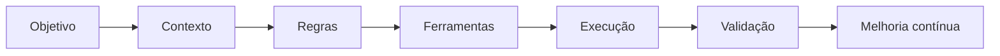

# Agentes de IA e Contexto Operacional

Este documento descreve como utilizo agentes de IA como apoio à organização, execução, análise e documentação de soluções digitais.

A IA não substitui o entendimento do problema. Ela funciona melhor quando recebe contexto estruturado, regras claras e limites bem definidos.

## Princípios

- IA precisa de contexto.
- Agentes devem ter papéis claros.
- Informação sensível deve ser tratada com cuidado.
- Bases de conhecimento precisam ser organizadas.
- O resultado deve ser revisado e melhorado continuamente.
- Automação só faz sentido quando reduz ruído, retrabalho ou tempo operacional.

## Estrutura de um agente

---
Componentes importantes
Objetivo

O agente precisa saber para que existe.

Exemplos:

Apoiar documentação.
Resumir contexto.
Interpretar demandas.
Consultar uma base de conhecimento.
Auxiliar em decisões operacionais.
Gerar checklist.
Apoiar integração com ferramentas.
Contexto

O contexto pode vir de:

Documentação técnica.
Regras de negócio.
Pastas organizadas.
Bases em Obsidian, Notion ou arquivos markdown.
Dados estruturados.
Histórico de decisões.
Regras

Um agente precisa de limites:

O que pode responder.
O que não pode decidir sozinho.
Quando deve pedir validação humana.
Como lidar com dados sensíveis.
Como registrar incertezas.
Uso prático

Em projetos digitais, agentes podem apoiar:

Escrita de documentação.
Leitura de APIs.
Organização de requisitos.
Criação de fluxos.
Geração de checklists.
Análise de inconsistências.
Apoio à tomada de decisão.
Resultado esperado

O objetivo não é criar agentes por moda. O objetivo é transformar informação desorganizada em apoio real para execução, operação e melhoria contínua.
