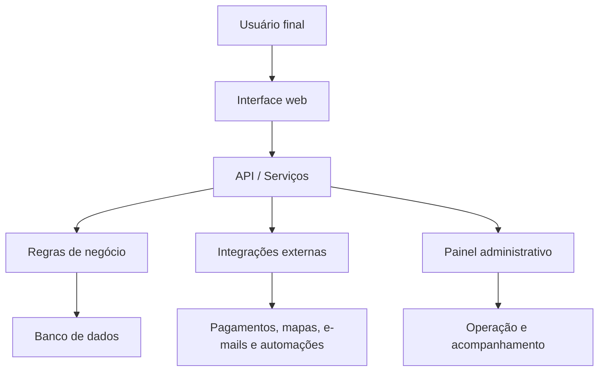

# Arquitetura da Metodologia

Este documento descreve como estruturo soluções digitais para que elas sejam funcionais, operáveis e fáceis de evoluir.

A arquitetura parte de uma ideia simples: antes de escolher tecnologia, é preciso entender o fluxo real da operação, as regras de negócio, os usuários envolvidos, os dados necessários e os pontos de decisão.

---

## Princípios

- Clareza antes de implementação.
- Regras de negócio documentadas.
- Separação entre interface, lógica, dados e operação.
- APIs organizadas e rastreáveis.
- Painel administrativo como parte do produto, não como detalhe.
- Deploy, domínio, e-mail, segurança e operação considerados desde o início.
- Evolução contínua baseada no uso real.

---

## Camadas da solução

---

## O que considero em cada projeto

### Interface

- Clareza visual.
- Responsividade.
- Fluxo simples para o usuário.
- Acessibilidade básica.
- Conversão e experiência.

### Backend e regras

- Estados do processo.
- Permissões.
- Validações.
- Logs importantes.
- Integrações.
- Tratamento de erros.

### Operação

- Painel administrativo.
- Gestão de pedidos, produtos, clientes ou conteúdos.
- Acompanhamento de status.
- Atualização em tempo real quando necessário.
- Documentação para continuidade.

---

## Resultado esperado

Uma solução não deve ser apenas bonita ou tecnicamente interessante. Ela precisa funcionar na operação real, ser compreensível para quem usa e ter estrutura para evoluir.
