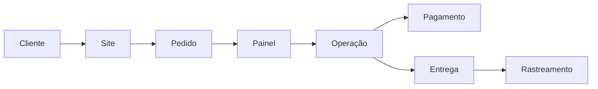
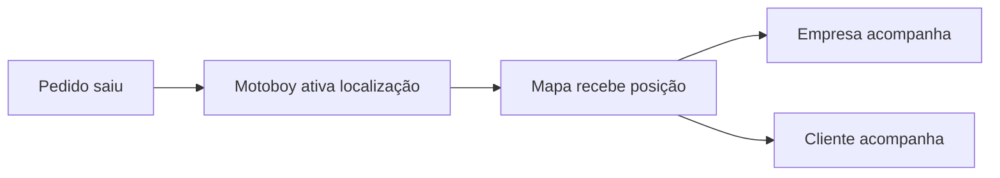

# Plataformas de Delivery e E-commerce

Este documento descreve a lógica aplicada em plataformas comerciais desenvolvidas com foco em operação real.

Os projetos envolvem sites públicos, painéis administrativos, controle de produtos, pedidos, pagamentos, estoque, clientes, status operacionais e acompanhamento logístico.

## Projetos relacionados

- Bruttus
- Japa House
- Shoes For You

## Fluxo operacional base

---
Funcionalidades comuns
Site público
Vitrine de produtos.
Categorias.
Página de produto.
Carrinho ou fluxo de pedido.
Informações comerciais.
Páginas legais.
Experiência responsiva.
Painel administrativo
Cadastro de produtos.
Edição de catálogo.
Controle de estoque.
Gestão de pedidos.
Atualização de status.
Controle de clientes.
Gestão de motoboys quando aplicável.
Visualização operacional.
Pagamentos
Integração Pix.
Confirmação de pagamento.
Organização de status.
Registro da operação.
Entrega e logística
Acionamento de motoboy.
Atualização de status.
Rastreamento por mapa.
Visão compartilhada para empresa e cliente.
Exemplo de rastreamento

---
Diferencial

O foco não é apenas construir uma loja ou cardápio online. O foco é criar uma operação digital completa, com gestão, rastreabilidade, controle e evolução.
