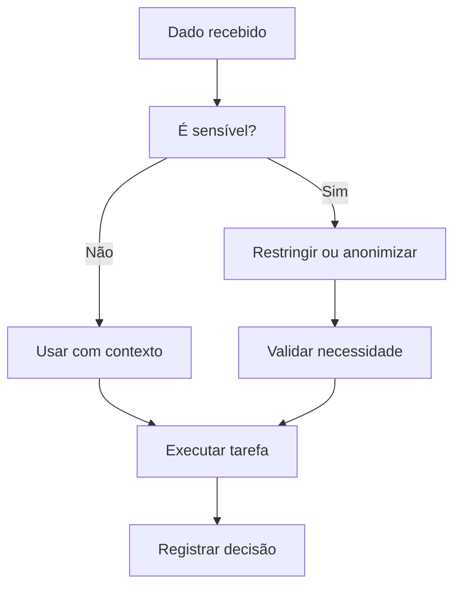

# Governança, LGPD e Informação Sensível

Este documento organiza princípios básicos para lidar com informações sensíveis em soluções digitais, automações e uso de IA.

Não substitui análise jurídica, mas serve como guia técnico-operacional para reduzir riscos e criar práticas mais responsáveis.

## Princípios

- Coletar apenas o necessário.
- Definir finalidade clara para os dados.
- Evitar exposição desnecessária.
- Controlar permissões.
- Registrar regras de uso.
- Separar dados sensíveis de dados operacionais sempre que possível.
- Revisar o que entra em ferramentas de IA.

## Dados que exigem atenção

- Dados pessoais.
- Dados financeiros.
- Informações de clientes.
- Endereços.
- Telefones.
- E-mails.
- Documentos.
- Dados comerciais sensíveis.
- Informações internas de operação.

## IA e informação sensível

Antes de usar IA com dados internos, avaliar:

- O dado precisa mesmo ser enviado?
- Pode ser anonimizado?
- Existe autorização?
- O agente precisa acessar tudo?
- O resultado exige validação humana?
- A resposta pode vazar informação?

## Regras para agentes


```
Checklist
- [ ] A finalidade do dado está clara?
- [ ] O acesso é realmente necessário?
- [ ] Existe risco de exposição?
- [ ] O dado pode ser minimizado?
- [ ] A IA recebeu apenas o contexto necessário?
- [ ] Há validação humana para decisões importantes?
```
---
Resultado esperado

Uso mais seguro de dados, redução de exposição e maior clareza sobre como informações são tratadas dentro de processos digitais.
