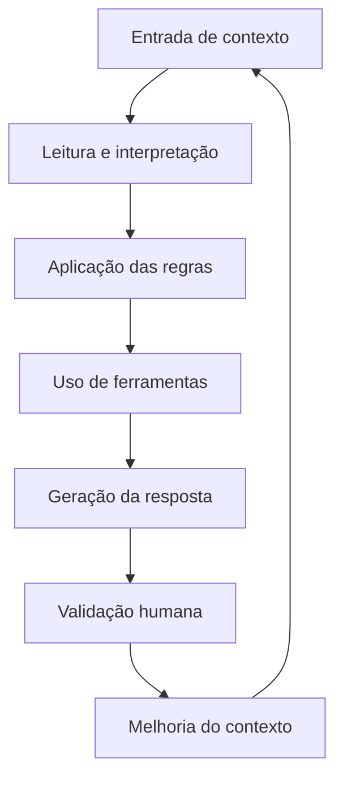

# Contexto para Agente de IA

Este template serve para estruturar agentes de IA com objetivo, contexto, regras, limites, ferramentas e critérios de qualidade.

A proposta é evitar agentes genéricos, sem direção ou sem controle. Um agente útil precisa saber o que deve fazer, o que não deve fazer, quais informações pode usar e quando deve pedir validação humana.

---

## 1. Identificação do agente

**Nome do agente:**

```md
Exemplo: Agente de Documentação Técnica
```

**Área ou domínio:**

```md
Exemplo: Produto, Operação, Atendimento, Financeiro, Desenvolvimento, Documentação, Comercial.
```

**Responsável pela configuração:**

```md
Nome da pessoa responsável.
```

---

## 2. Objetivo

Descreva de forma clara para que o agente existe.

```md
O agente tem como objetivo...
```

**Exemplos:**

- Apoiar documentação técnica.
- Organizar requisitos.
- Interpretar regras de negócio.
- Resumir contexto operacional.
- Consultar uma base de conhecimento.
- Apoiar análise de dados.
- Auxiliar na criação de checklists.
- Apoiar integração com ferramentas.

---

## 3. O que o agente deve fazer

Liste as tarefas permitidas.

```md
- 
- 
- 
- 
```

**Exemplo:**

```md
- Ler documentos internos fornecidos como contexto.
- Resumir informações em linguagem clara.
- Identificar dúvidas, inconsistências e lacunas.
- Sugerir próximos passos com base nas regras fornecidas.
- Gerar checklists operacionais.
```

---

## 4. O que o agente não deve fazer

Liste limites claros para evitar respostas inadequadas.

```md
- 
- 
- 
- 
```

**Exemplo:**

```md
- Não inventar dados ausentes.
- Não tomar decisões críticas sem validação humana.
- Não expor informações sensíveis.
- Não alterar regras de negócio sem autorização.
- Não apresentar hipóteses como fatos.
```

---

## 5. Fontes de contexto

Informe quais materiais o agente pode usar.

```md
- Documentação técnica:
- Regras de negócio:
- APIs:
- Banco de dados:
- Pastas:
- Links:
- Obsidian:
- Notion:
- Arquivos markdown:
- Outros:
```

**Observações sobre o contexto:**

```md
Descreva quais fontes são confiáveis, quais precisam ser validadas e quais não devem ser usadas.
```

---

## 6. Regras de resposta

Defina como o agente deve responder.

```md
- Responder com clareza.
- Separar fatos, hipóteses e recomendações.
- Indicar incertezas.
- Não inventar informações.
- Pedir validação quando necessário.
- Proteger informações sensíveis.
- Usar linguagem adequada ao público.
```

**Formato preferido de resposta:**

```md
Exemplo: resumo executivo, lista de ações, checklist, tabela, plano passo a passo, documentação técnica.
```

---

## 7. Ferramentas disponíveis

Liste ferramentas, integrações e recursos que o agente pode usar.

```md
- API:
- Banco de dados:
- Arquivos:
- Automação:
- Busca:
- Planilhas:
- CRM:
- ERP:
- GitHub:
- E-mail:
- Outro:
```

**Regras de uso das ferramentas:**

```md
- Quando usar:
- Quando não usar:
- Quem valida:
- O que registrar:
```

---

## 8. Dados sensíveis e LGPD

Avalie se o agente terá contato com informações sensíveis.

```md
- Dados pessoais:
- Dados financeiros:
- Endereços:
- Telefones:
- E-mails:
- Documentos:
- Dados comerciais:
- Informações internas:
```

**Cuidados obrigatórios:**

```md
- Minimizar dados enviados ao agente.
- Evitar exposição desnecessária.
- Anonimizar quando possível.
- Solicitar validação humana em decisões sensíveis.
- Não usar dados fora da finalidade definida.
```

---

## 9. Fluxo de funcionamento



---

## 10. Critério de qualidade

Uma boa resposta do agente precisa:

```md
- [ ] Responder ao objetivo definido.
- [ ] Usar apenas informações disponíveis ou autorizadas.
- [ ] Indicar dúvidas ou lacunas.
- [ ] Ser clara para o público-alvo.
- [ ] Separar fatos de recomendações.
- [ ] Respeitar regras de segurança e LGPD.
- [ ] Ser útil para tomada de decisão ou execução.
```

---

## 11. Exemplos de entrada e saída

### Exemplo de entrada

```md
Analise este fluxo de pedidos e identifique riscos, lacunas e próximos passos.
```

### Exemplo de saída esperada

```md
Resumo:
- O fluxo cobre pedido, pagamento e entrega.
- Há lacuna na regra de cancelamento.
- Não está claro quem atualiza o status de entrega.

Riscos:
- Pedido pode ficar sem responsável.
- Cliente pode não receber atualização.
- Operação pode não saber quando acionar motoboy.

Próximos passos:
1. Definir status possíveis.
2. Definir responsável por cada status.
3. Criar regra de cancelamento.
4. Validar mensagens para cliente.
```

---

## 12. Versão e evolução

**Versão do agente:**

```md
v1.0
```

**Última atualização:**

```md
DD/MM/AAAA
```

**Melhorias futuras:**

```md
- [ ] 
- [ ] 
- [ ] 
```

---

## Resumo executivo do agente

```md
Este agente foi criado para [objetivo], usando como contexto [fontes principais]. Ele pode [tarefas permitidas], mas não deve [limites principais]. Suas respostas devem seguir [formato/regras] e qualquer decisão sensível deve passar por validação humana.
```
